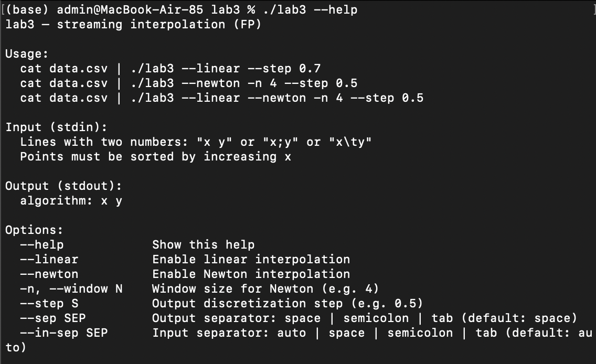
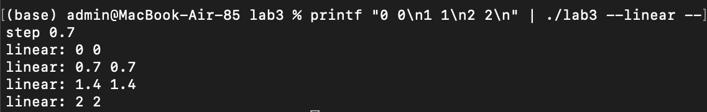
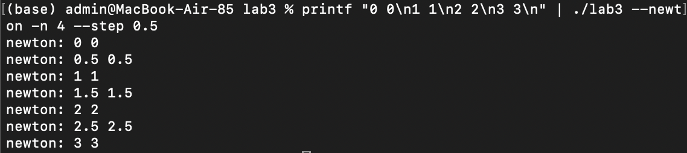
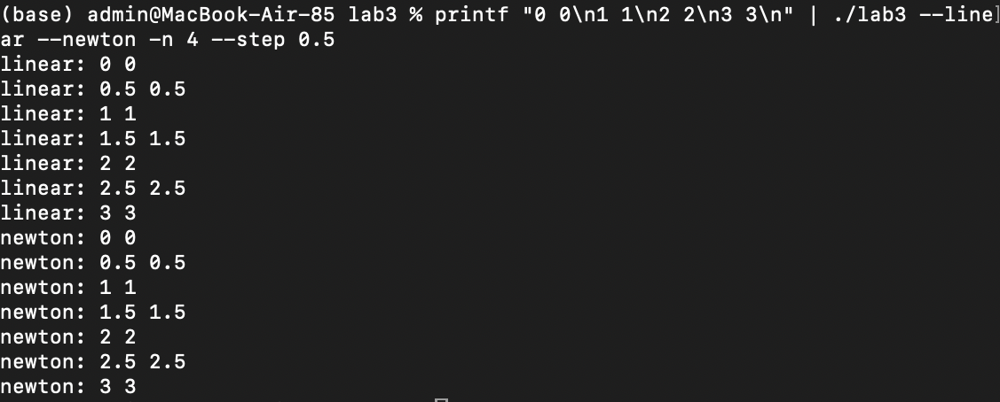

# Отчёт по ЛР №3 (Функциональное программирование)

**Студент:** Юрисов Всеволод Евгеньевич  
**Группа:** P3320  
**Вариант:** интерполяция (линейная + Ньютон)  
**Язык:** Elixir  

---

## 1. Цель работы
Освоить потоковый ввод/вывод, обработку данных в streaming-режиме, CLI-аргументы,
разделение IO и алгоритмов, а также использование конкурентности Elixir
(простые процессы + supervisor/genserver).

---

## 2. Требования к ПО
- Ввод: stdin, текстовый формат `x y` / `x;y` / `x<TAB>y`, вход отсортирован по x  
- Вывод: stdout, строки вида `alg: x y`  
- Настройки через CLI: выбор алгоритма, шаг дискретизации, размер окна для Ньютона, разделители  
- Потоковый режим: вывод по мере поступления достаточного количества точек  
- Разделение: IO отдельно от алгоритмов  
- Параллельность:
  - Engine — отдельный процесс через `spawn`
  - Reader — `GenServer` под `Supervisor`

---

## 3. Архитектура
Пайплайн:
1) Reader читает stdin (stream) и отправляет точки в Engine сообщениями  
2) Engine хранит состояние (предыдущая точка/буфер окна) и печатает результат в stdout  

Файлы:
- `lib/lab3/io/parser.ex` — парсинг строк в `{x, y}`
- `lib/lab3/io/reader.ex` — GenServer читает stdin → отправляет `{:point, p}` и `:eof`
- `lib/lab3/stream/engine.ex` — процесс через spawn, интерполяция + печать
- `lib/lab3/alg/linear.ex` — линейная интерполяция
- `lib/lab3/alg/newton.ex` — Ньютон (разделённые разности)
- `lib/lab3/app_supervisor.ex` — supervisor для Reader (+ Engine создаётся при init)
- `lib/lab3/cli.ex` — CLI, парсинг аргументов, запуск supervisor

---

## 4. Ключевые элементы реализации

### 4.1 Линейная интерполяция
Коротко: на каждом отрезке между точками `{x0,y0}` и `{x1,y1}` считаем:
`y = y0 + ((x-x0)/(x1-x0))*(y1-y0)`.

### 4.2 Ньютон
Коротко: строим коэффициенты через разделённые разности и считаем полином Ньютона.

### 4.3 Потоковый режим и “окна”
- Linear: достаточно 2 точек (предыдущая + текущая)
- Newton: нужен буфер из `n` точек (скользящее окно), печать идёт по мере наполнения окна

### 4.4 Конкурентность
- Engine — отдельный процесс (`spawn + receive`) принимает сообщения и печатает результат
- Reader — `GenServer` читает stdin потоково и шлёт Engine точки
- Supervisor гарантирует управление жизненным циклом Reader

---

## 5. Примеры ввода/вывода (скриншоты)

### Запуск (help)

### Линейная интерполяция

### Ньютон (n=4)

### Оба алгоритма

---

## 6. Выводы
В ходе работы реализовано потоковое приложение с разделением IO и чистых алгоритмов,
поддержкой CLI-конфигурации и конкурентной моделью Elixir (spawn + supervisor/genserver).
